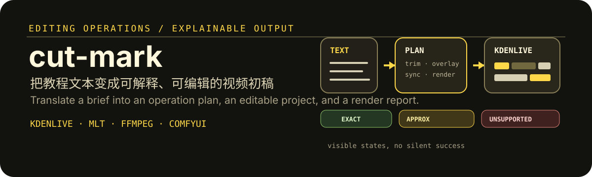

# cut-mark

  

  <strong>网页与教程文本自动剪辑工具</strong> 
  Turn a text brief into an explainable operation plan, an editable Kdenlive project, and an MP4.

## 这是什么 / What it is

cut-mark 面向需要快速制作可编辑视频初稿的创作者与运营人员。默认路线使用 Kdenlive 26.04.2 生成可编辑工程并自动渲染 MP4；剪映能力保留为显式 fallback，不会在默认流程中启动。

cut-mark does not hide unsupported editing instructions. It reports whether an operation is represented exactly, approximated locally, or unavailable in the current runtime.

## 核心能力 / What you can do

- 读取网页正文、教程步骤或视频文案，并将其解析为操作计划。
- 将操作映射为 Kdenlive/MLT 时间线，交付可编辑工程和 MP4。
- 对 exact、approximated、unsupported 三类能力给出明确状态，不静默伪装成功。
- 使用内容哈希生成确定性输出名，记录渲染、决策与能力报告。
- 通过字幕提取、场景切分、ComfyUI 场景替换和换装变化检测扩展视频处理。
- 在 Kdenlive 不适用时提供显式的剪映 UI fallback，并在校准失败时安全停止。

## 工作流 / How it works

1. 导入内容文本、视频或素材。
2. 生成可阅读的 Operation Plan，并识别每项编辑能力的状态。
3. 使用 Kdenlive/MLT 生成工程与时间线。
4. 渲染 MP4，写入报告、日志和最终决策。
5. 按需调用字幕、场景替换或换装检测等独立模块。

The default deliverable is editable. A rendered MP4 is useful, but it is not the only artifact you receive.

## 安装与准备 / Install and prepare

~~~powershell
python -m pip install -r requirements.txt
Copy-Item config.example.json config.json
~~~

将网页正文、教程步骤或提取的视频文案保存到 input/content.txt。可选素材放入 assets 目录，并使用 01.png、02.mp4、03.jpg 等自然顺序命名。

assets 为空时，脚本会生成 generated/default_black.png 作为默认黑色素材。不同内容会得到不同的 8 位内容哈希输出名。

## 默认主流程 / Default Kdenlive route

~~~powershell
uv run python generate_draft.py --config config.json --input input/content.txt --assets assets --mode operations
~~~

典型输出：

~~~text
output/web_transition_video_<content-hash>.kdenlive
output/web_transition_video_<content-hash>.mp4
generated/kdenlive_report.json
generated/kdenlive_render.log
generated/final_decision.txt
~~~

第一次运行会下载并缓存 Kdenlive Windows standalone runtime。下载包在解压使用前会校验固定大小和 SHA-256。

只生成可编辑工程而不渲染 MP4：

~~~powershell
uv run python generate_draft.py --config config.json --input input/content.txt --assets assets --mode operations --route kdenlive-project
~~~

## 能力状态 / Capability states

| 状态 | 含义 / Meaning |
| --- | --- |
| exact | 能用 Kdenlive/MLT 直接表达。 |
| approximated | 使用本地视觉或时间线近似表达。 |
| unsupported | 当前运行时缺少对应能力；系统会报告，不会伪装为成功。 |

## 文案与字幕 / Text and subtitles

从本地视频提取文案：

~~~powershell
uv run python local_video_text.py "D:/videos/demo.mp4" --output input/content.txt
~~~

从网络视频创建操作任务：

~~~powershell
uv run python generate_draft.py --config config.json --video-url "https://example.com/video" --assets assets --mode operations
~~~

没有平台字幕时，可在 config.json 中启用本地 Whisper：

~~~json
"whisper_mode": "local",
"whisper_model": "base",
"language": "zh"
~~~

## 扩展工作流 / Extension workflows

### ComfyUI 场景换人或换背景

该路径会先切分场景，再为每个场景匹配人物和背景参考图，调用 ComfyUI 处理后合并输出。

~~~text
refs/
  default_person.png
  default_background.png
  scene_001_person.png
  scene_001_background.png
~~~

导出真实可用的 ComfyUI API workflow 后替换 comfy/workflows/realistic_replace.json；必要时在 config.json 中调整 comfy_workflow_bindings。

~~~powershell
uv run python video_replace.py --video "D:/videos/input.mp4" --refs refs --workflow comfy/workflows/realistic_replace.json --output-dir output
~~~

### 按换装切分视频

~~~powershell
uv run python scene_split_preview.py "D:/videos/input.mp4" --output-dir generated/clothing_split/input --preset outfit-change --clip-prefix outfit
~~~

outfit-change 会优先尝试 YOLO 人体区域检测；没有安装 ultralytics 时会回退到固定上身区域裁剪。

## 剪映 fallback / Jianying fallback

默认流程不使用剪映。只有明确选择 route 时才会进入相关路径：

~~~powershell
uv run python generate_draft.py --config config.json --input input/content.txt --assets assets --mode operations --route jianying
uv run python generate_draft.py --config config.json --input input/content.txt --assets assets --mode operations --route ui-only
~~~

只有显式加入 --ui-mode experimental 才会尝试操作剪映 UI。该模式不会自动导出、删除素材或修改系统设置；找不到剪映或校准失败时会停止并写入 generated/ui_report.json。

## 运行边界 / Operational limits

- 请确保你拥有输入视频、音频、图片与网页内容的合法使用权。
- 自然语言剪辑要求可能存在歧义；执行前检查操作计划和能力报告。
- 本地模型、ComfyUI、Whisper 和 YOLO 依赖由使用者自行部署与配置。
- 长视频、生成式处理和高分辨率渲染会显著增加时间与硬件消耗。
